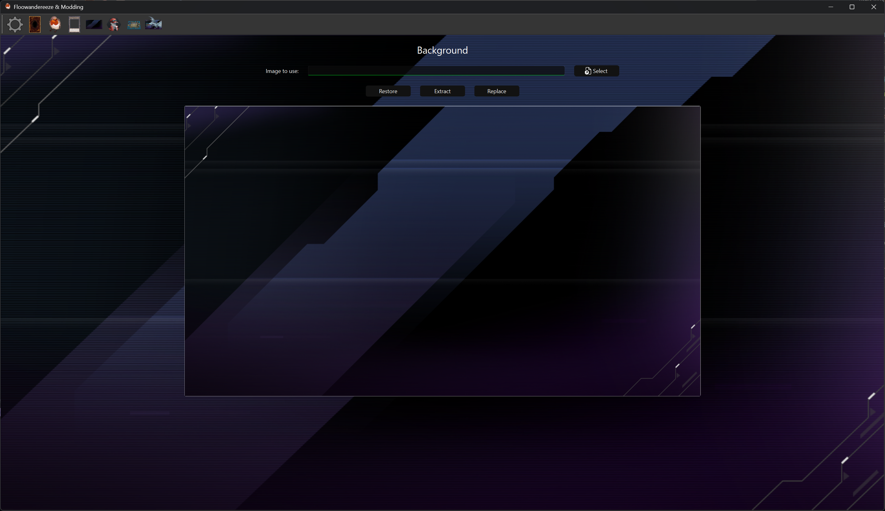

# Background Editor

The Background Editor page allows you to modify the home background in Yu-Gi-Oh! Master Duel. This page provides
functionality to view, replace, and manage the home background asset.

## Features

- Background preview
- Background texture replacement
- Texture extraction
- Backup and restore functionality

## Interface Elements

### Preview Section

- Shows the current home background
- Updates in real-time when changes are made

### Action Buttons

- **Select Image**: Choose a new background image
- **Replace**: Apply the selected image to the background
- **Extract**: Extract the background texture
- **Restore**: Restore the background from backup

## Usage

1. **Viewing Current Background**
      - The current home background is automatically loaded

2. **Replacing Background**
      - Click "Select Image" to choose a new background image
      - The image will be automatically resized to 1920x1080
      - Click "Replace" to apply the changes
      - A backup will be created if enabled in settings

3. **Extracting Textures**
      - Click "Extract" to save the current background
      - The texture will be saved to the "images" folder

4. **Managing Backups**
      - Click "Restore" to revert to the original version
      - A notification will indicate if backup exists

## Notes

- The background texture is stored in the Unity3D file, so it can be frequently reverted by game updates, and other mods that replace the Unity3D file will revert any changes
- Images are automatically resized using Lanczos resampling
- The background is a single asset that affects the entire home screen and most duel screens
