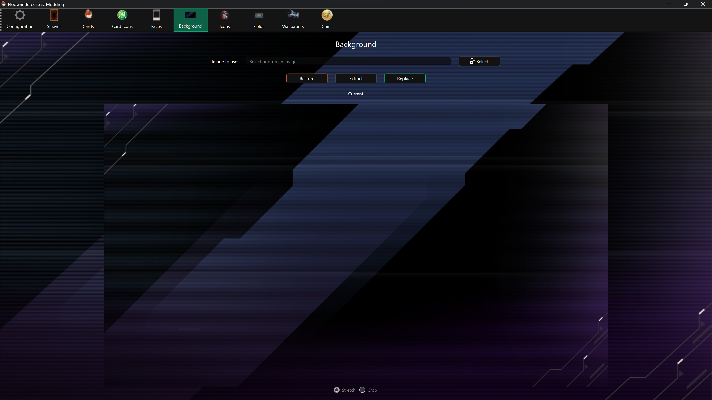

# Background Editor

The Background Editor changes the shared 1920×1080 texture used on the home screen and in many menu screens. This is different from the custom application background configured on the Configuration page.

## Replace the background

1. Choose a PNG or JPEG with **Select**, or drag it onto the page.
2. Choose **Replace**.

The source is resized to exactly 1920×1080 with high-quality resampling. Use a 16:9 source to avoid distortion. The Current preview refreshes after replacement.

## Extract and restore

- **Extract** saves the current texture under `images`.
- **Restore** writes the saved automatic backup back to the shared Unity data file.

Enable backups before the first replacement. Background uses one special backup file rather than a type-specific bundle backup.

## Important limitation

The background is stored in `masterduel_Data\data.unity3d`. Master Duel updates and other mods that replace this file can remove the background change, along with Card Face or Card Icon changes stored in the same file.
