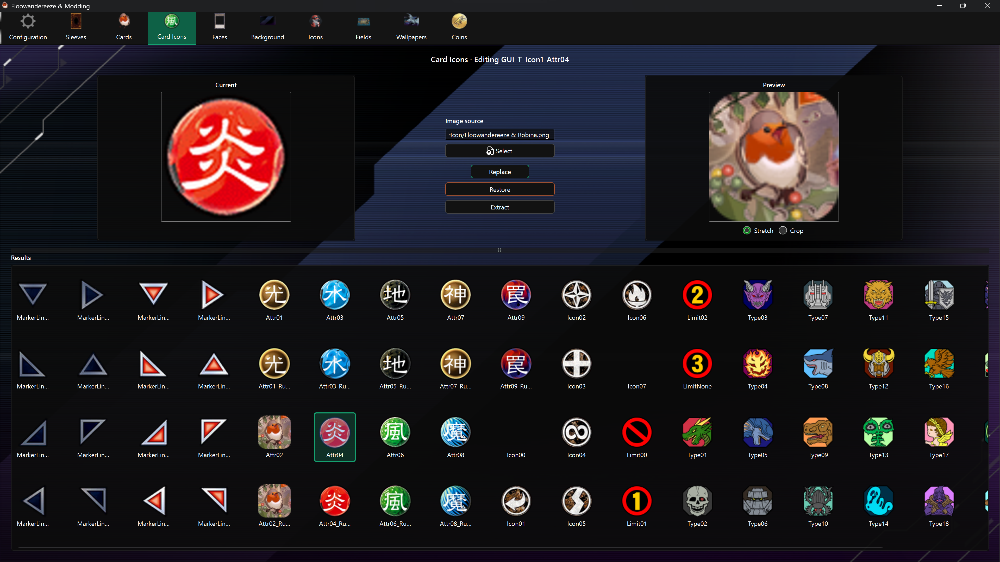

# Card Icon Editor

The Card Icon Editor changes small card-related graphics stored inside Master Duel's shared card sprite atlas.

## Replace an icon

1. Select an icon from **Results**.
2. Choose a PNG or JPEG with **Select**, or drag an image onto the page.
3. Compare **Current** and **Preview**.
4. Choose **Replace**.

The app resizes the source to the selected atlas region and replaces the complete region, including transparent pixels. PNG is strongly recommended when the icon needs transparency.

## Extract and restore

- **Extract** crops the selected region from the atlas and saves it under `images\icons` using the icon's name.
- **Restore** patches the backed-up region into the atlas.

Automatic backup captures the selected region immediately before its first replacement, provided backups are enabled.

## Important limitation

All card icons share `masterduel_Data\data.unity3d`. A game update or another mod that replaces this file may remove every card-icon change, plus other modifications stored in the same file. Refresh the app data after game updates before editing the atlas again.
