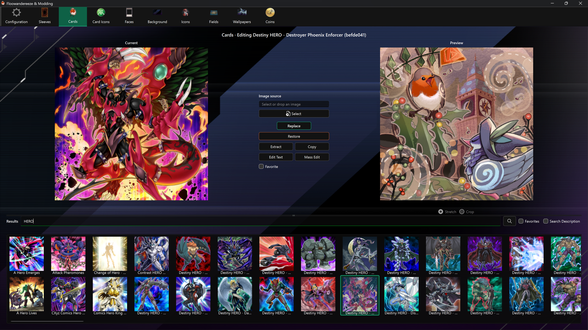
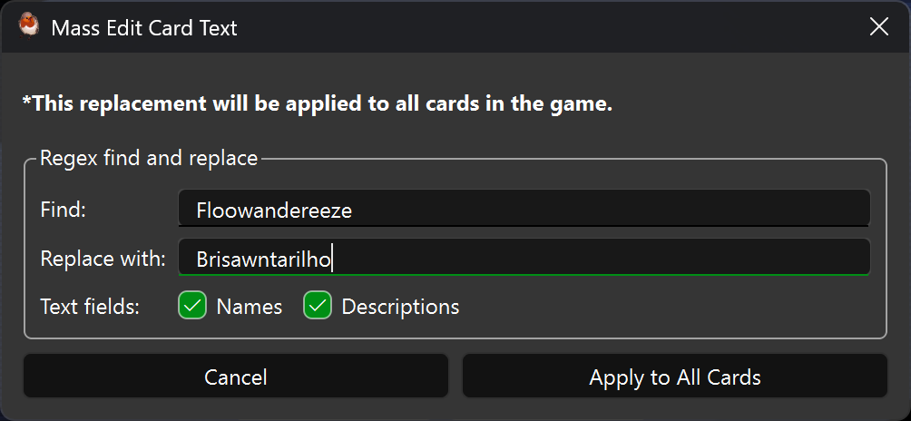

# Card Editor

The Card Editor replaces card artwork and edits card names and descriptions. It also provides search, favorites, extraction, bundle copying, and regular-expression text replacement.

## Find and select a card

Enter at least three characters and press Enter or use the search button. Search is case-insensitive and matches partial original card names. The autocomplete list can be used for quick selection.

- **Search Description** includes original card descriptions in the search.
- **Favorites** shows only cards marked as favorites.
- **Favorite** changes the selected card's saved favorite status.

Select a result to load its current artwork and enable its actions. A saved modded name appears in the editor context alongside the original name.

## Replace card artwork

1. Select a card.
2. Choose a PNG or JPEG with **Select**, or drag it onto the page.
3. Check **Preview**.
4. Choose **Replace**.

The replacement keeps the source image's dimensions, so start with artwork prepared for the target card texture. Pendulum art may look stretched in the app's square thumbnail preview even when the actual replacement works.

## Edit one card's text

Choose **Edit Text** to open the selected card's dialog.

- Edit **Name** and **Description**, then choose **Replace**.
- **Restore Name** and **Restore Description** put the original values back into the dialog before saving.
- Both fields must remain non-empty for a direct replacement.

The same dialog can apply a Python regular-expression replacement to the selected card. Enter a pattern and replacement, choose Names and/or Descriptions, then use **Apply Regex to Card**. Capture groups such as `\1` are supported in replacement text.

## Mass edit card text

**Mass Edit** applies one regular-expression replacement across all cards. Choose whether it targets names, descriptions, or both. The app validates the pattern and asks for confirmation before changing files.

Mass editing changes every match, not only the current search results. Test the expression on one card first and keep the default confirmation enabled.

## Extract, copy, and restore

- **Extract** writes the card texture to `images\cards`.
- **Copy** writes the complete bundle to `bundles\cards`.
- Cards stored directly in `data.unity3d` can be extracted but cannot be copied as standalone bundles.
- **Restore** writes the automatic image backup back to the selected card.

Card-text edits are tracked separately from image backups. Use Configuration's text **Restore All** or **Reapply All** for bulk text maintenance.

## Notes

- Card text operations can take significantly longer than image replacement because shared metadata must be refreshed and rewritten safely.
- Search uses the original card text, not a saved modded name or description.
- Enable backups before the first artwork replacement if you want per-card Restore to work.
