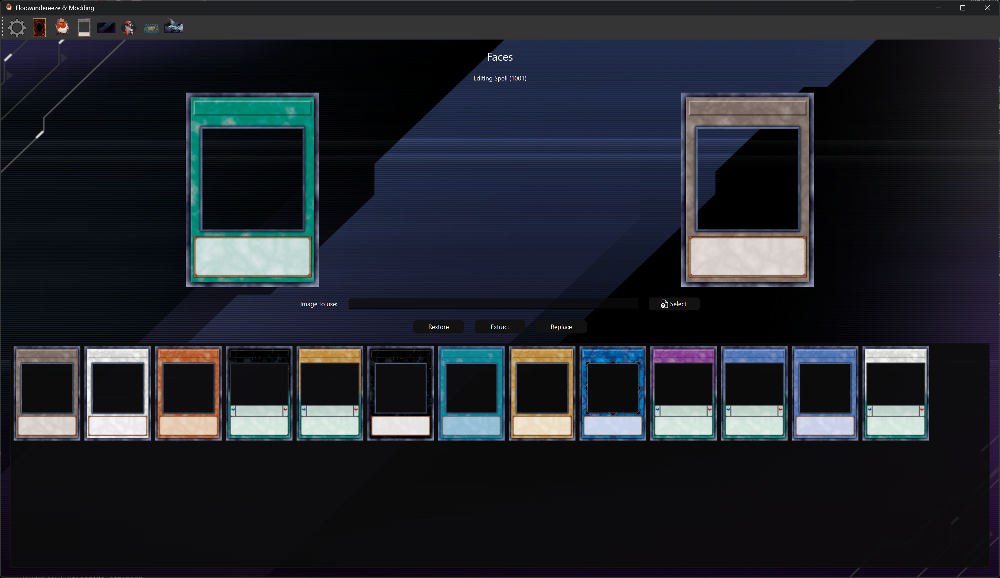

# Card Face Editor

The Card Face Editor page allows you to modify the face textures of cards in Yu-Gi-Oh! Master Duel. This page provides functionality to view, replace, and manage card face assets.

## Features

- Card face list with preview
- Card face texture replacement
- Texture extraction
- Backup and restore functionality
- Real-time preview updates

## Interface Elements

### Card Face List

- Displays all available card face textures
- Click on a face to select it for editing
- Shows the face name and key information

### Preview Section

- Shows the currently selected card face texture
- Displays the face's key information
- Updates in real-time when changes are made

### Action Buttons

- **Select Image**: Choose a new face texture image
- **Replace**: Apply the selected image to the face
- **Extract**: Extract the face texture
- **Restore**: Restore the face from backup

## Usage

1. **Selecting a Card Face**

      - Click on a face in the list to select it
      - The preview will update to show the selected face
      - Action buttons will become enabled

2. **Replacing Face Texture**
      - Click "Select Image" to choose a new face texture
      - Preview the selected image
      - Click "Replace" to apply the changes
      - A backup will be created if enabled in settings

3. **Extracting Textures**
      - Select a face
      - Click "Extract" to save the texture
      - The texture will be saved to the "faces" folder

4. **Managing Backups**
      - Select a modified face
      - Click "Restore" to revert to the original version
      - A notification will indicate if backup exists

## Notes

- The application creates backups automatically if enabled in settings
- Face textures are stored in the Unity3D file, so they can be frequently reverted by game updates, and other mods that replace the Unity3D file will revert any changes
- Face names are automatically slugified for file operations
