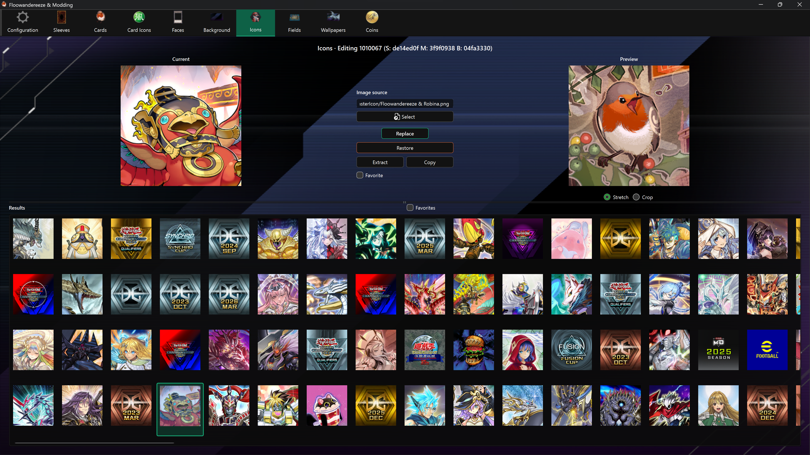

# Player Icon Editor

The Player Icon Editor replaces profile icons and manages the small, medium, and large bundles as one asset.

## Replace an icon

1. Select an icon from **Results**.
2. Choose a square PNG or JPEG with **Select**, or drag it onto the page.
3. Check **Preview** and choose **Replace**.

The app resizes the source and writes all three icon resolutions. Use a square image to avoid distortion; PNG is recommended when transparency matters. **Current** displays the medium version.

## Other actions

- **Favorite** marks the selected icon; **Favorites** filters the result grid.
- **Extract** saves all three textures under `images\icons`.
- **Copy** saves all three Unity bundles under `bundles\icons`.
- **Restore** uses the backup of the largest version to rebuild all three sizes.

Enable backups before the first replacement. Only the largest original texture is stored as the automatic backup.
