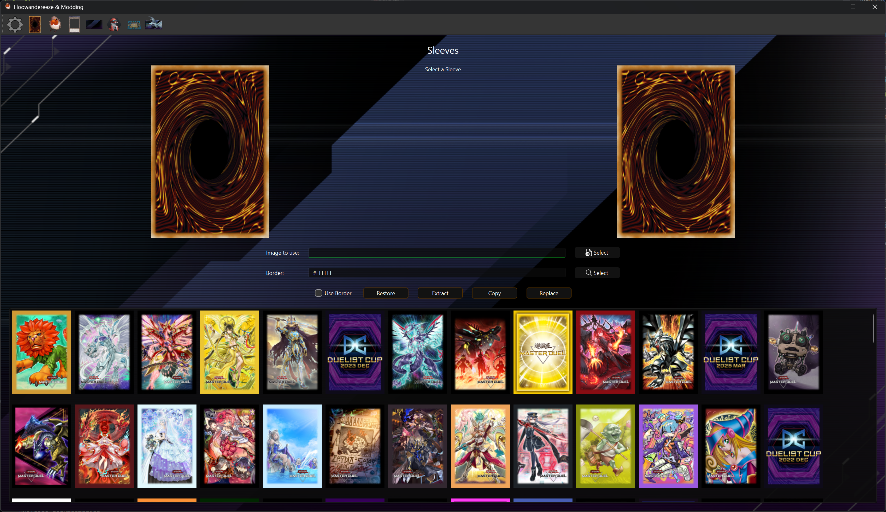

# Card Sleeve Editor

The Card Sleeve Editor page allows you to modify card sleeves in Yu-Gi-Oh! Master Duel. This page provides functionality to view, replace, and customize card sleeves with optional border effects.

## Features

- Card sleeve list with preview
- Sleeve texture replacement
- Texture extraction
- Border customization
- Backup and restore functionality
- Real-time preview updates

## Interface Elements

### Card Sleeve List

- Displays all available card sleeves
- Click on a sleeve to select it for editing

### Preview Section

- Shows the currently selected card sleeve
- Displays the selected sleeve's bundle information
- Updates in real-time when changes are made
- Supports border preview toggle

### Action Buttons

- **Select Image**: Choose a new sleeve texture image
- **Replace**: Apply the selected image to the sleeve
- **Copy**: Copy the sleeve bundle to the sleeves folder
- **Extract**: Extract the sleeve texture
- **Border Color**: Choose a color for the sleeve border
- **Restore**: Restore the sleeve from backup

### Border Options

- Checkbox to toggle border
- Color picker for border customization
- Border width is set to 15 pixels

## Usage

1. **Selecting a Card Sleeve**
      - Click on a sleeve in the list to select it
      - The preview will update to show the selected sleeve
      - Action buttons will become enabled

2. **Replacing Sleeve Texture**
      - Click "Select Image" to choose a new sleeve texture
      - Preview the selected image
      - Click "Replace" to apply the changes
      - A backup will be created if enabled in settings

3. **Customizing Border**
      - Click "Border Color" to choose a color
      - Use the checkbox to toggle border preview
      - The border will be applied when replacing the sleeve

4. **Extracting Textures**
      - Select a sleeve
      - Click "Extract" to save the texture
      - The texture will be saved to the "sleeves" folder

5. **Managing Backups**
      - Select a modified sleeve
      - Click "Restore" to revert to the original version
      - A notification will indicate if backup exists

## Notes

- The application creates backups automatically if enabled in settings
- Border customization is optional and can be toggled on/off
