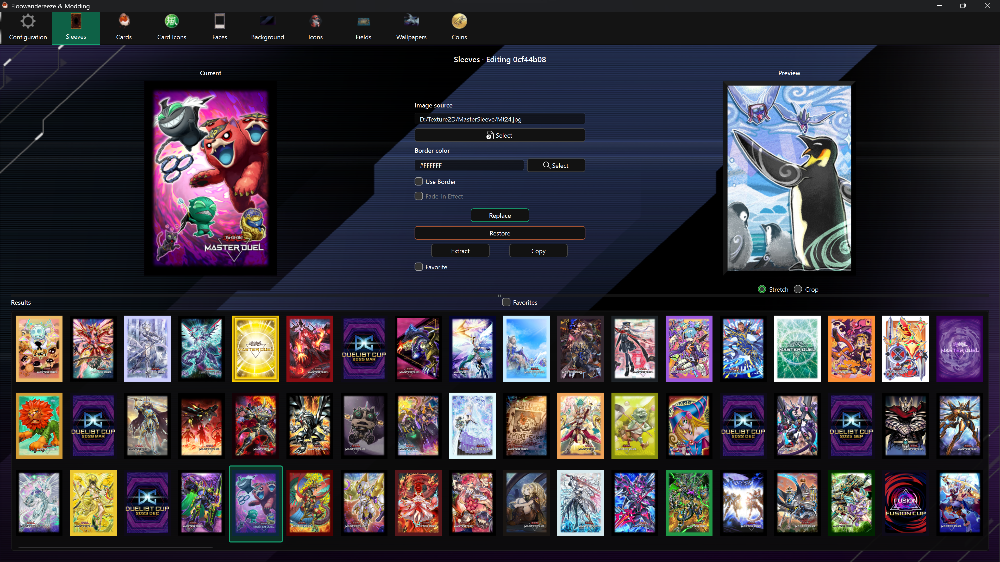

# Card Sleeve Editor

The Card Sleeve Editor replaces sleeve textures and can add an optional colored border.

## Replace a sleeve

1. Select a sleeve from **Results**.
2. Choose a portrait PNG or JPEG with **Select**, or drag it onto the page.
3. Optionally configure the border.
4. Choose **Replace**.

Match the portrait aspect ratio shown by the current sleeve to avoid stretching.

## Add a border

1. Choose the border color with the color **Select** button.
2. Enable **Use Border**.
3. Optionally enable **Fade-in Effect** for a softer transition into the artwork.

The preview shows the border color but does not fully render the fade. The complete effect is generated during replacement. Disabling **Use Border** also disables the fade.

## Other actions

- **Favorite** marks the selected sleeve; **Favorites** filters the results.
- **Extract** saves the texture under `images\sleeves`.
- **Copy** saves the complete Unity bundle under `bundles\sleeves`.
- **Restore** writes the automatic backup back to the selected sleeve.

Enable backups before the first replacement if you want Restore to work.
