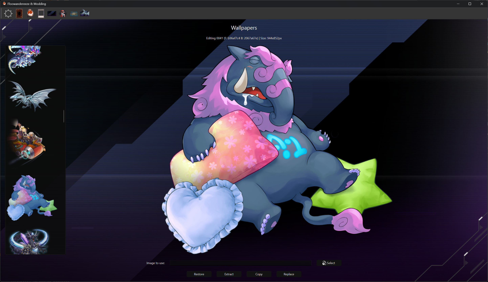

# Wallpaper Editor

The Wallpaper Editor page allows you to modify wallpapers in Yu-Gi-Oh! Master Duel. This page provides functionality to view, replace, and manage wallpaper assets, which consist of both foreground and background components.

## Features

- Wallpaper list with preview
- Wallpaper texture replacement
- Texture extraction for both layers
- Bundle copying
- Backup and restore functionality
- Real-time preview updates
- Image size information display

## Interface Elements

### Wallpaper List

- Displays all available wallpapers
- Click on a wallpaper to select it for editing
- Shows the wallpaper name and bundle information

### Preview Section

- Shows the currently selected wallpaper
- Displays the wallpaper at its actual ratio
- Shows the foreground layer

### Action Buttons

- **Select Image**: Choose a new wallpaper image
- **Replace**: Apply the selected image to the wallpaper
- **Copy**: Copy the wallpaper bundle to the wallpapers folder
- **Extract**: Extract both wallpaper textures
- **Restore**: Restore the wallpaper from backup

### Information Display

- Shows the wallpaper name
- Displays both foreground and background bundle names
- Shows the actual image dimensions

## Usage

1. **Selecting a Wallpaper**
      - Click on a wallpaper in the list to select it
      - The preview will update to show the selected wallpaper
      - Action buttons will become enabled
      - Image dimensions will be displayed

2. **Replacing Wallpaper**
      - Click "Select Image" to choose a new wallpaper
      - Click "Replace" to apply the changes
      - A backup will be created if enabled in settings

3. **Extracting Textures**
      - Select a wallpaper
      - Click "Extract" to save both textures
      - The textures will be saved to the "wallpapers" folder

4. **Managing Backups**
      - Select a modified wallpaper
      - Click "Restore" to revert to the original version
      - A notification will indicate if backup exists

## Notes

- Wallpapers consist of many layers; the app threats the first as the foreground to be replaced, and the second as the background to be removed, some wallpapers have more than 2 layers, and those are not currently replaced by the app
- Both layers are extracted when using the extract function
- The application creates backups automatically if enabled in settings
- Some wallpapers have special effects, such as sparks, those are not replaced by the app
