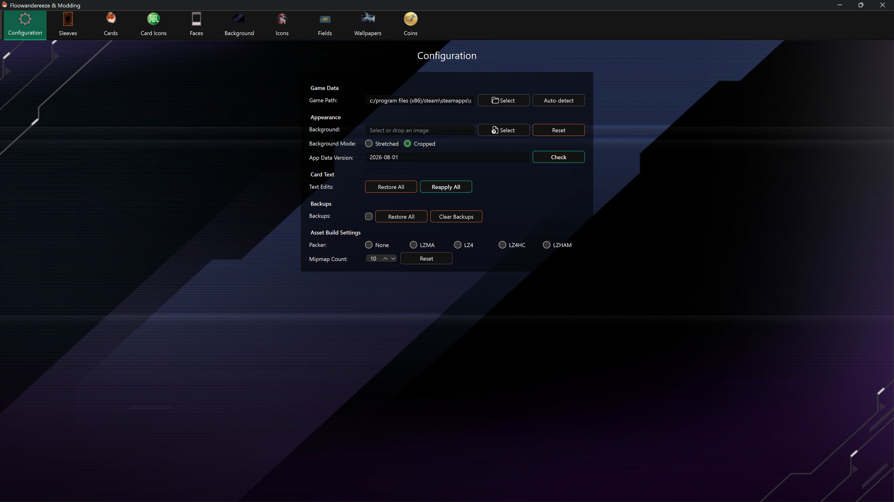

# Getting Started

## Requirements

- Windows 10 or later
- Yu-Gi-Oh! Master Duel installed through Steam
- The in-game data download completed for the player profile you want to mod

Python is only required when running the project from source.

## Install and launch

For the packaged application:

1. Download the latest Windows executable from the project's [GitHub Releases](https://github.com/Nauder/floowandereeze-and-modding-qt/releases).
2. Put it in a folder where you want the app's database, exports, bundle copies, and backups to remain.
3. Close Master Duel.
4. Run the executable.

Windows may show a SmartScreen warning for an unsigned build. Confirm that you downloaded the file from the project's release page before choosing to run it.

## Select your game data

On a new installation, only **Configuration** is available until a valid game path is saved.

The easiest option is **Auto-detect**. It searches the Steam installation and every library listed in `libraryfolders.vdf`, then lets you choose among the detected player profiles.

For manual selection, choose the player-ID folder under:

```text
<Steam library>\steamapps\common\Yu-Gi-Oh!  Master Duel\LocalData\<player ID>
```

Select the folder whose contents begin with directories such as `0000`; do not select `LocalData`, `masterduel_Data`, or `data.unity3d` itself. The placeholder profile folder `00000000` is not a usable player profile.



After saving the path, the app starts its first data update if no local data version exists. Wait for all update tasks to finish, then restart the application to load the editor pages.

## Enable backups before editing

Backups are disabled by default. On **Configuration**, enable **Backups** before your first replacement. The first replacement of an asset then saves its current texture under `backups\<asset type>`.

A backup only protects the texture captured when it was created. Clearing backups is permanent, and enabling backups after an asset was already changed cannot recreate the original texture.

## Make a first replacement

1. Open an editor from the top toolbar.
2. Select an asset from **Results**.
3. Choose a PNG or JPEG with **Select**, or drag an image onto the page.
4. Compare **Current** and **Preview**.
5. Choose **Replace** and wait for the success notification.
6. Start Master Duel and check the asset in the game.

PNG is recommended, especially when transparency matters. The app resizes images as required by each asset, but using the same aspect ratio as the current texture avoids stretching or empty space.

## Where files are saved

Folders are created beside the application (or in the current working directory when running from source):

| Folder | Contents |
| --- | --- |
| `images\<asset type>` | PNG textures created with **Extract** |
| `bundles\<asset type>` | Original game bundles created with **Copy** |
| `backups\<asset type>` | Automatic texture backups used by **Restore** |

The Background editor exports its texture directly under `images`, while most other editors use a type-specific subfolder.

## Run from source

Developers can use the repository's PowerShell workflow:

```powershell
python -m venv .venv
.\.venv\Scripts\Activate.ps1
pip install -r requirements.txt
.\dev.ps1
```

`dev.ps1` activates `.venv`, regenerates the Qt UI/resources, and launches `main.py`. The project currently targets Python 3.11 for development.
