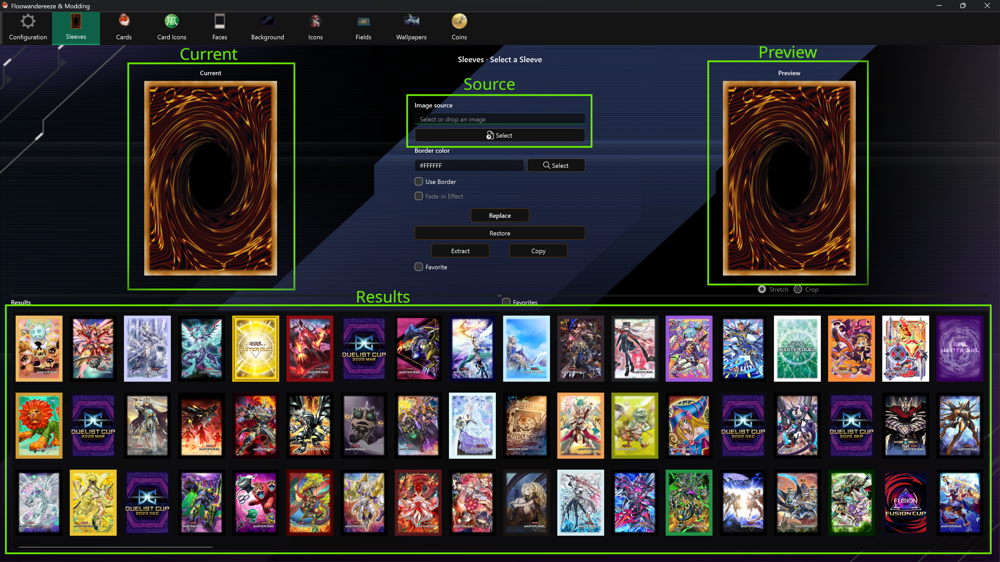

# Using the Editors

Most asset pages follow the same workflow: select an asset, choose a source image, inspect the preview, and replace the game texture.

## Page layout

- **Current** shows the texture currently installed in the game files.
- **Preview** shows the selected source image. It is a visual guide; final resizing and processing happen during replacement.
- **Image source** shows the chosen file path. Use **Select** or drag an image anywhere onto the page.
- **Results** contains the available assets. Select one to enable its actions.
- The horizontal grip between the editor and results can be dragged on the responsive grid pages. Its position is remembered separately for each editor.

The application has a minimum window size of 960×540 and opens maximized. Preview panels and result grids adapt to the available space.

## Common actions

| Action | Result |
| --- | --- |
| **Select** | Chooses a PNG or JPEG source image and updates Preview. |
| **Replace** | Writes the processed image into the selected game asset. |
| **Extract** | Saves the selected texture as a PNG under `images`. Multi-size or multi-layer assets export every relevant texture. |
| **Copy** | Copies the unedited Unity bundle under `bundles`. Use this when another modding tool needs the whole bundle. |
| **Restore** | Replaces the selected texture using the app's backup, if one exists. |
| **Favorite** | Marks the selected item for the editor's Favorites filter. |

Buttons remain disabled until the required asset or image has been selected. A notification in the application reports success, missing backups, and errors.

## Image preparation

- Use PNG for artwork with transparency; use PNG or JPEG for opaque artwork.
- Match the current asset's aspect ratio whenever possible.
- Keep important content away from the extreme edges, since the game may mask or crop textures.
- Animated GIFs are not preserved as animations.
- The app converts and resizes the source for the target texture. Player icons and coins are written to small, medium, and large bundles automatically.

## Backups and safe modding

Enable backups on [Configuration](features/config.md) before replacing anything. For most editors, the app captures the current texture only once, immediately before the first replacement.

Recommended workflow:

1. Close Master Duel.
2. Enable backups.
3. Extract the original texture or copy its bundle if you want an additional manual copy.
4. Replace one asset and test it in game before making many changes.
5. Keep your source images outside the game's folders so they survive game updates.

**Restore** is not a mod conflict manager. If another mod or game update changed the same bundle before the backup was created, the backup may contain that changed version. **Clear Backups** permanently removes the app's automatic backup images.

## Game updates and mod conflicts

Master Duel can redownload changed files during an update. Any other mod that replaces the same Unity bundle can also overwrite your changes, or be overwritten by this app.

Shared-file editors deserve extra care:

- Background, Card Faces, and Card Icons modify textures inside `masterduel_Data\data.unity3d`.
- Wallpapers modify both a foreground and a background bundle.
- Card text updates shared metadata bundles that affect every card.

After a game update, open **Configuration**, use **Check** to refresh the app's asset data, and then reapply your mods. Saved card text can be reapplied with **Reapply All**.
